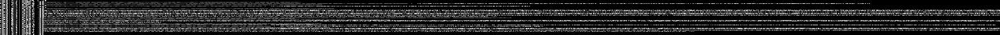
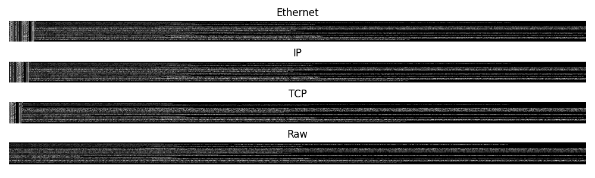
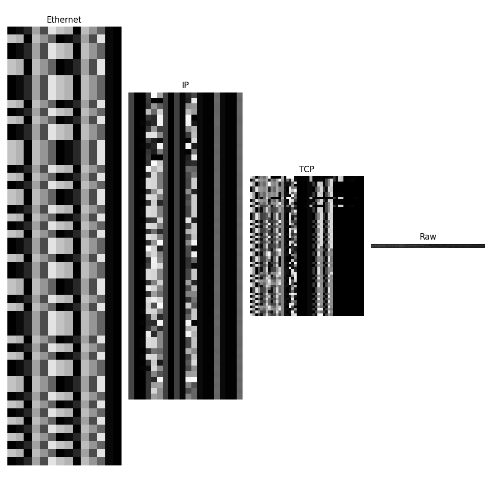

# Session Feature Extractor (sfe)

> **Requirements:**
> - Python 3.10+
> - [scapy](https://scapy.net/) (Python package, see pyproject.toml)
> - [editcap](https://www.wireshark.org/docs/man-pages/editcap.html) (external tool, for PCAP/PCAPNG conversion)
> - For HPC/cluster use: [apptainer](https://apptainer.org/) (or Singularity) is recommended for containerized workflows.

A Python package for extracting, reconstructing, and visualizing session-based features from network traffic (PCAP files). Designed for research and practical applications in network intrusion detection, traffic analysis, and machine learning.

---

## Features
- **Session & Packet Extraction:** Extracts sessions and packets from PCAPs, supporting TCP/IP stack and custom protocols.
- **Layer-wise Array & Header Extraction:** Converts packets/sessions into numpy arrays for each protocol layer and their headers.
- **Reconstruction:** Reconstructs packets and sessions from numpy arrays, enabling round-trip conversion.
- **Batch Processing CLI:** Powerful command-line interface for batch extraction, filtering, and output management.
- **Visualization:** Generates grayscale images from session/packet arrays for ML and visualization.
- **Flexible Mapping:** Supports dynamic column mapping from CSV label files and mapping.json.
- **Multiprocessing:** Efficient parallel processing for large datasets.
- **Logging:** Detailed logging with Loguru.
- **Unit Tests:** Robust test coverage for core extraction and reconstruction logic.

---

## Installation

```bash
pip install .
```
Or with PIP: `pip install session-feature-extractor`

- Requires Python 3.10+
- See `pyproject.toml` for dependencies (scapy, numpy, pandas, opencv-python, loguru, tqdm, etc.)

---

## Quick Start

### 1. Extract Sessions & Features from PCAPs

```bash
python examples/extraction.py \
  --data_dir assets/sample_pcaps \
  --out_dir temp/my_output \
  --temp_dir temp/my_temp \
  --num_processes 2 \
  --write_array --write_image \
  --hours_to_subtract 3 \
  --min_labeled_pkts 5 \
  --max_labeled_pkts 100
```

- **PCAP/CSV pairs** and a `mapping.json` are required in `assets/sample_pcaps`.
- Output images, arrays, and CSVs will be saved in `temp/my_output`.

### 2. Demo: Session/Packet Extraction & Reconstruction

See [`examples/session_packet.py`](examples/session_packet.py) for a full demonstration:
- Extracts packets and sessions from a sample PCAP
- Converts to numpy arrays (full, per-layer, per-header)
- Reconstructs packets and sessions from arrays
- Generates and saves images
- Tested with following datasets: 
  - [DNP3 Intrusion Detection Dataset](https://zenodo.org/records/7348493) 
  - [ROSIDS23](https://zenodo.org/records/10014434)
  - [IEC104](https://zenodo.org/records/15487636)

---

## Sample Outputs

Below are sample images generated from the extraction pipeline, demonstrating the different representations of a network session:

**Session Array:**

This image shows the entire session as a 2D grayscale array, where each row represents a packet and each column represents a byte (padded as needed). Useful for ML models that operate on raw session data.



**Layer Arrays:**

This image visualizes the extracted arrays for each protocol layer (e.g., Ethernet, IP, TCP) within the session. Each layer's bytes are shown separately, highlighting protocol structure.



**Header Arrays:**

This image displays only the header bytes for each protocol layer, excluding payloads. It is useful for focusing on protocol metadata and structure, which can be important for traffic analysis and intrusion detection.



---

## Directory Structure

- `sfe/core/packet/packet.py` – Packet class, array/header extraction, reconstruction
- `sfe/core/session/session.py` – Session class, aggregation, from_array
- `sfe/data/extractor.py` – Main extraction pipeline, batch processing
- `examples/extraction.py` – CLI entry point for batch extraction
- `examples/session_packet.py` – Demo: extraction, array/image generation, reconstruction
- `assets/sample_pcaps/` – Sample PCAP/CSV pairs and mapping.json
- `docs/assets/sample_images/` – Example output images
- `temp/my_output/` – Output images, arrays, and CSVs

---

## Mapping & Column Configuration

- Place a `mapping.json` in your PCAP/CSV directory to map PCAP filenames to CSV label files.
- The extractor dynamically reads CSV columns and applies them to the `ColumnMapping` dataclass for flexible workflows.

---

## Testing

Run all unit tests:

```bash
python -m unittest discover tests
```

---

## License

MIT
